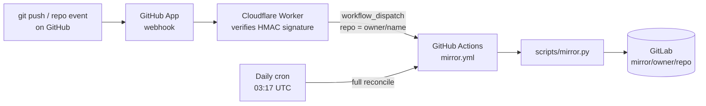

<div align="center">



<br>

[](LICENSE)
[-3776AB?logo=python&logoColor=white)](scripts/mirror.py)
[](.github/workflows/mirror.yml)
[](worker/worker.js)
[](#1-gitlab)

**Keep an always-up-to-date backup of every GitHub repository you own — on GitLab.**<br>
Push to GitHub, and seconds later the same commits, branches and tags are on GitLab.<br>
No servers to run. No per-repo setup. New repos are picked up automatically.

[Quick start](#quick-start) · [How it works](#how-it-works) · [Configuration](#configuration-reference) · [Troubleshooting](#troubleshooting) · [FAQ](#faq)

</div>

---

## Table of contents

- [Features](#features)
- [How it works](#how-it-works)
- [What you need](#what-you-need)
- [Quick start](#quick-start)
  - [1. GitLab](#1-gitlab)
  - [2. Create your private `mirror-hub` repo](#2-create-your-private-mirror-hub-repo)
  - [3. Dispatch token](#3-dispatch-token)
  - [4. Cloudflare Worker](#4-cloudflare-worker)
  - [5. GitHub App](#5-github-app)
  - [6. Test it](#6-test-it)
- [Configuration reference](#configuration-reference)
- [White-list / black-list](#white-list--black-list)
- [Behaviour notes](#behaviour-notes)
- [Run it locally](#run-it-locally)
- [Costs and limits](#costs-and-limits)
- [Security](#security)
- [Troubleshooting](#troubleshooting)
- [FAQ](#faq)
- [Project structure](#project-structure)
- [License](#license)

---

## Features

- **Near-instant mirroring** — a `push` on GitHub triggers a mirror run of *that one repo* within seconds.
- **Covers everything you own** — your personal account and every organization you belong to, with one install per account.
- **Auto-discovery** — newly created, renamed, transferred, archived, or visibility-changed repos are synced automatically.
- **Tidy GitLab layout** — `mirror/<github-owner>/<repo>`; each owner gets its own private subgroup.
- **True mirror** — GitLab always equals GitHub: force-pushes, deleted branches and deleted tags are replicated.
- **Safe backup semantics** — repos deleted on GitHub are **kept** on GitLab.
- **Git LFS support** — LFS objects are fetched from GitHub and pushed to GitLab before the refs.
- **Daily safety net** — a scheduled full reconcile catches anything a webhook might have missed.
- **White-list / black-list** — choose exactly which repos are mirrored.
- **Self-hosted GitLab supported** — point `GITLAB_URL` at your own instance.
- **Zero dependencies** — the mirror script uses only the Python standard library and `git`.
- **Hardened** — HMAC-verified webhooks, secrets masked in logs, retries on failure, per-repo concurrency control.

## How it works



1. **GitHub App** — installed on your account and orgs, it only exists to send `push` and `repository` webhooks.
2. **Cloudflare Worker** — checks the `X-Hub-Signature-256` HMAC and, if the event is relevant, calls `workflow_dispatch` on this repo with the `owner/repo` that changed.
3. **GitHub Actions** — runs `scripts/mirror.py` with `TARGET_REPO=owner/repo` (single repo) or empty (full reconcile of everything the token can see).
4. **`mirror.py`** — creates the GitLab group/project if needed, compares refs on both sides, and only pushes when something differs.

## What you need

| Requirement | Notes |
|---|---|
| A GitHub account (and optionally orgs) | You need permission to install a GitHub App on each account you want mirrored. |
| A GitLab account | gitlab.com or self-hosted. You must be **Owner** of the top-level mirror group. |
| A Cloudflare account | The free plan is enough for the Worker. |
| Node.js + npm | Only to install and deploy with `wrangler`. |
| `openssl` (or any random-hex generator) | To create the webhook secret. |

## Quick start

> Total setup time: about 15 minutes. Do the steps in order.

### 1. GitLab

1. Create a **top-level group** named `mirror` (or any name — you will set it as the `GITLAB_GROUP` repo variable).
2. Create a **classic Personal Access Token** with scopes `api` + `write_repository`.
   The token's user must be **Owner** of the group (needed to create subgroups).

### 2. Create your private `mirror-hub` repo

1. Create a new **private** repo named `mirror-hub` on GitHub, and push this project's contents to its `main` branch:

   ```bash
   git clone https://github.com/bhawan-kavinda/mirror-hub.git
   cd mirror-hub
   git remote set-url origin git@github.com:<you>/mirror-hub.git
   git push -u origin main
   ```

2. Go to **Settings → Secrets and variables → Actions** and add:

   | Type | Name | Value |
   |---|---|---|
   | Secret | `GH_PAT` | Classic PAT with `repo` + `read:org`. If an org enforces SSO, click **Configure SSO → Authorize** on the token. |
   | Secret | `GITLAB_PAT` | The GitLab token from step 1. |
   | Variable *(recommended)* | `GITLAB_GROUP` | Your top-level GitLab group path (e.g. `mirror`). |
   | Variable *(optional)* | `GITLAB_URL` | Default `https://gitlab.com`. Set for self-hosted GitLab. |
   | Variable *(optional)* | `INCLUDE_FORKS` | Default `true`. |
   | Variable *(optional)* | `INCLUDE_ARCHIVED` | Default `true`. |

3. Open the **Actions** tab → **mirror** → **Run workflow** with `repo` left **empty**. This performs the initial full mirror of everything.

### 3. Dispatch token

Create a **fine-grained PAT** for the Worker:

- **Repository access:** only `mirror-hub`
- **Repository permissions:** **Actions → Read and write**

This is the `DISPATCH_PAT` used in the next step.

### 4. Cloudflare Worker

```bash
cd worker
# 1) edit HUB_REPO in wrangler.toml to "<you>/mirror-hub"
npm i -g wrangler
wrangler login

openssl rand -hex 32               # copy this value: it is your WEBHOOK_SECRET
wrangler secret put WEBHOOK_SECRET # paste the value above
wrangler secret put DISPATCH_PAT   # paste the fine-grained PAT from step 3

wrangler deploy                    # prints https://mirror-webhook.<you>.workers.dev
```

Visiting the Worker URL in a browser (a `GET`) returns `mirror webhook ok` — handy as a quick liveness check.

### 5. GitHub App

**Settings → Developer settings → GitHub Apps → New GitHub App**

| Field | Value |
|---|---|
| Webhook URL | The Worker URL from step 4 |
| Webhook secret | The `WEBHOOK_SECRET` from step 4 |
| Repository permissions | **Contents: Read**, **Metadata: Read** (nothing else) |
| Subscribe to events | **Push**, **Repository** |
| Where can this app be installed? | **Any account** (required so orgs can install it) |
| Private key / client secret | **Not needed** — the app is only used to send webhooks |

Then **Install App** on your personal account (*All repositories*) and repeat for every org you want mirrored (org owners may need to approve). New repos are covered automatically.

> **Tip:** GitHub App logos must be PNG/JPG. Export `assets/icon.svg` to a PNG (e.g. 512×512) to use it as the app logo.

### 6. Test it

Push a commit to any repo. Within seconds:

- the **Actions** tab of `mirror-hub` shows a new `mirror` run, and
- the repo appears at `mirror/<owner>/<repo>` on GitLab.

If nothing happens, open the GitHub App's settings → **Advanced** to inspect webhook deliveries.

## Configuration reference

### GitHub Actions (repo → Settings → Secrets and variables → Actions)

| Name | Kind | Default | Description |
|---|---|---|---|
| `GH_PAT` | secret | — **required** | Classic PAT, scopes `repo` + `read:org`. Used to list and clone your repos. |
| `GITLAB_PAT` | secret | — **required** | GitLab PAT, scopes `api` + `write_repository`. |
| `GITLAB_GROUP` | variable | see note | Top-level GitLab group that holds all mirrors. |
| `GITLAB_URL` | variable | `https://gitlab.com` | Base URL of your GitLab instance. |
| `INCLUDE_FORKS` | variable | `true` | Set `false` to skip forks. |
| `INCLUDE_ARCHIVED` | variable | `true` | Set `false` to skip archived repos. |

> **Note on `GITLAB_GROUP`:** always set this variable explicitly so the group name never depends on a fallback default.

### Cloudflare Worker

| Name | Kind | Description |
|---|---|---|
| `WEBHOOK_SECRET` | secret | Must match the GitHub App's webhook secret. |
| `DISPATCH_PAT` | secret | Fine-grained PAT with *Actions: Read and write* on `mirror-hub`. |
| `HUB_REPO` | var (`wrangler.toml`) | `<owner>/mirror-hub` — the repo whose workflow is dispatched. |
| `HUB_REF` | var (`wrangler.toml`) | Branch to run the workflow on. Default `main`. |

The workflow file **must** be named `mirror.yml` — the Worker dispatches it by name.

### Events the Worker reacts to

| GitHub event | Actions | Result |
|---|---|---|
| `push` | all | Mirror that repo. |
| `repository` | `created`, `renamed`, `transferred`, `archived`, `unarchived`, `privatized`, `publicized`, `edited` | Re-sync that repo (e.g. default-branch change). |
| `repository` | `deleted` | **Ignored on purpose** — the GitLab copy is kept as a backup. |
| `ping` | — | Replies `pong`. |
| anything else | — | `202 ignored`. |

Worker responses: `401` bad signature · `202` dispatched/ignored · `502` the GitHub dispatch call failed.

## White-list / black-list

Both files live in the repo root, next to this README. Entries can be `https://github.com/owner/repo` or just `owner/repo` (case-insensitive; `.git` suffixes are fine).

**`black-list.json`** — skip specific repos entirely (no clone, no push):

```json
{
  "repos": ["https://github.com/owner/repo", "owner/another-repo"]
}
```

A missing or empty file means nothing is skipped.

**`white-list.json`** — mirror *only* the listed repos:

```json
{
  "only_white_list": "on",
  "repos": ["https://github.com/owner/repo"]
}
```

| `only_white_list` | Behaviour |
|---|---|
| `"on"` | **Only** listed repos are mirrored. The black-list is **ignored** (white-list wins). An empty list mirrors nothing. |
| `"off"` or file missing | The file is ignored. |

Accepted "on" values: `"on"`, `true`, `"true"`, `"yes"`, `"1"`.

## Behaviour notes

**What is mirrored**

- `refs/heads/*` and `refs/tags/*` (GitLab rejects `refs/pull/*`). PR merges still reach the default branch through the normal push event.
- **Git LFS objects** (uploaded to GitLab before the refs are pushed).
- The **default branch** setting.

**What is *not* mirrored**

- Issues, pull requests, wikis, releases, and other GitHub metadata.

**Mirror semantics**

- The mirror is **forced**: GitLab always equals GitHub. Anything changed directly on the GitLab copy will be overwritten.
- Branches/tags deleted on GitHub are deleted on GitLab.
- **Deleted repos are not deleted** on GitLab (backup behaviour).
- Branch protection on the GitLab copy is removed so force-pushes work.
- All GitLab projects and subgroups are created **private**.
- A **renamed** repo creates a new GitLab project; the old one stays.
- Names are slugified for GitLab (characters outside `A–Z a–z 0–9 _ . -` become `-`).
- Empty GitHub repos still get a GitLab project (status `empty`).
- If both sides already match, the run is a cheap no-op (status `skipped`).
- Each repo is retried once (after 5 s) before it is reported as `failed`.

**Run statuses** — `synced` · `skipped` · `empty` · `failed`. A summary is written to the workflow run's **Summary** page, and the job exits non-zero if any repo failed.

## Run it locally

Requires `python3`, `git`, and `git-lfs`.

```bash
export GH_PAT=ghp_xxx
export GITLAB_PAT=glpat-xxx
export GITLAB_GROUP=mirror              # optional, default: mirror
# export GITLAB_URL=https://gitlab.example.com
# export INCLUDE_FORKS=false
# export WORKERS=4                      # parallel repos, default 4

python3 scripts/mirror.py                       # full reconcile
TARGET_REPO=owner/repo python3 scripts/mirror.py  # just one repo
```

## Costs and limits

- Each push costs roughly **1 GitHub Actions minute**. Private repos get 2,000 free minutes/month on the free plan.
- The workflow has a 45-minute timeout and runs up to 4 repos in parallel.
- Runs are serialized **per repo** (`concurrency` group); a newer queued run replaces an older queued one, which is fine because every run mirrors the latest state.
- **Keep `mirror-hub` private.** Public repos get their scheduled workflows paused after 60 days of inactivity, and a public hub would expose your configuration.
- Cloudflare Workers' free plan comfortably covers webhook traffic for personal use.

## Security

- **Webhooks are authenticated.** The Worker verifies the HMAC-SHA256 signature (`X-Hub-Signature-256`) in constant time and returns `401` otherwise.
- **Least privilege.** The GitHub App needs only *Contents: Read* and *Metadata: Read*; the dispatch token is limited to *Actions: Read and write* on a single repo.
- **Secrets stay out of logs.** Tokens and their derived auth headers are masked and scrubbed from error output; checkout uses `persist-credentials: false`.
- **Your tokens have broad access.** `GH_PAT` can read all your repos, so anyone with write access to `mirror-hub` can reach it through Actions. Keep the repo private and don't grant collaborators access you wouldn't give them to your code.
- Rotate tokens periodically, and revoke them immediately if you suspect a leak.

## Troubleshooting

| Symptom | Likely cause / fix |
|---|---|
| No workflow run after a push | Check the GitHub App → **Advanced → Recent Deliveries**. `401` = webhook secret mismatch; `502` = bad `DISPATCH_PAT` or wrong `HUB_REPO`; no deliveries = app not installed on that account/repo. |
| `GitLab token rejected (401)` | Use a **classic** PAT with `api` + `write_repository`, and make sure it hasn't expired. |
| `GitLab group '…' not found` | Set the `GITLAB_GROUP` variable to your top-level group path. The error lists the groups your token can access. |
| `root group … not accessible` / subgroup creation fails | The token's user must be **Owner** of the top-level group. |
| `GitHub list repos failed: 403` | Authorize the PAT for SSO on each org that enforces it, and ensure `repo` + `read:org` scopes. |
| An org's repos are missing | The PAT owner must be a member of the org; also check the white/black-list files. |
| `invalid JSON` on startup | Fix syntax in `white-list.json` / `black-list.json`. |
| Push rejected on a protected branch | The script removes protections automatically; make sure the token user is at least Maintainer/Owner. |
| LFS errors | Confirm LFS is enabled on the GitLab project/instance and the token has `api` scope. |
| `invalid TARGET_REPO` | The `repo` input must look like `owner/repo`. |
| Scheduled run stopped | Public repos pause schedules after 60 days of inactivity — keep the hub private. |

## FAQ

**Does it back up issues, PRs and wikis?**
No — only Git data (branches, tags, LFS). Use GitHub's export tools if you need the rest.

**What if I delete a repo on GitHub?**
The GitLab copy stays. That's deliberate: it's a backup.

**Can I mirror only some repos?**
Yes — see [White-list / black-list](#white-list--black-list).

**Can I mirror to a self-hosted GitLab?**
Yes. Set the `GITLAB_URL` variable.

**Do I have to reinstall anything when I create a new repo?**
No. If the App is installed with *All repositories*, new repos are mirrored automatically.

**Is it one-way?**
Yes. GitHub → GitLab only. Changes made on GitLab are overwritten.

## Project structure

```
mirror-hub/
├── assets/
│   ├── banner.svg            # README banner
│   └── icon.svg              # project icon
├── .github/workflows/
│   └── mirror.yml            # dispatch + daily schedule → runs the script
├── scripts/
│   └── mirror.py             # the mirror engine (stdlib + git only)
├── worker/
│   ├── worker.js             # webhook receiver (Cloudflare Worker)
│   └── wrangler.toml         # Worker config (set HUB_REPO here)
├── black-list.json           # repos to skip
├── white-list.json           # repos to mirror exclusively (when on)
├── LICENSE
└── README.md
```

## License

Released under the [MIT License](LICENSE) © 2026 bhawan-kavinda.
